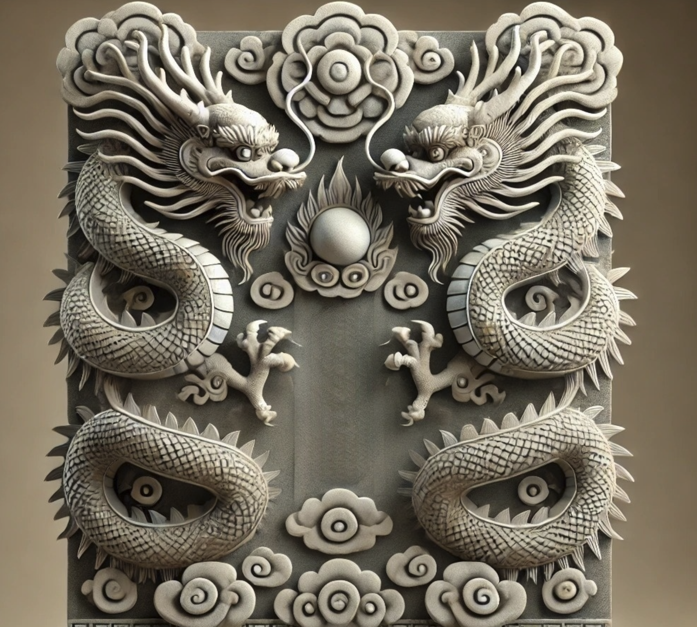

# Fùxì Benchmark

Fùxì  (负屃), a comprehensive benchmark that evaluates both understanding and generation capabilities across 21 diverse tasks.



## Overview

Fùxì (负屃) is a comprehensive benchmark designed to evaluate large language models on their understanding and generation capabilities of classical Chinese culture and literature. The benchmark covers 21 diverse tasks across multiple domains including classical literature, poetry, idiom, traditional Chinese medicine (TCM), and more.


All task descriptions:

| Task | Description | Type | Eval Metric | # |
|------|-------------|------|-------------|---|
| Ancient Chinese RC | Multiple choice question on ancient Chinese text reading comprehension | NLU | Acc | 300 |
| Idiom RC | Multiple choice question on idiom reading comprehension | NLU | Acc | 1000 |
| TCM Syndrome RC | Multiple choice question on TCM syndrome differentiation | NLU | Acc | 1098 |
| Loan Character QA | Loan character identification question answering | NLG | Acc | 500 |
| Allegorical Saying QA | Allegorical saying question answering, to complete the second half | NLG | Acc | 553 |
| Book Author | Given a book title, answer the author | NLG | Acc | 384 |
| Book Dynasty | Given a book title, answer the dynasty | NLG | Acc | 372 |
| Book Collection Classification | Classify book titles into 10 collections | NLG | Acc | 532 |
| Poetry Generation | Poetry creation according to topic words | NLG | Acc | 300 |
| Poetry Line Source Tracing | Identify the source of a poem line | NLG | Acc | 400 |
| Famous Quote Source Tracing | Identify the source of a classical Chinese quote | NLG | Acc | 200 |
| Idiom Source Tracing | Name the source book or essay of an idiom | NLG | Acc | 962 |
| Inverse Poetry Translation | Decipher the original poem from translated modern Chinese version | NLG | Acc | 300 |
| Poetry Translation | Translate a poem into modern Chinese | NLG | BLEU | 300 |
| Ancient Chinese Translation | Translate ancient Chinese text into modern Chinese (extracted from the erya dataset) | NLG | BLEU | 1000 |
| Poetry Appreciation | Analysis of imagery, style, sentiment in classical Chinese poetry | NLG | BLEU | 109 |
| Idiom Explanation | Idiom explanation | NLG | BLEU | 1236 |
| TCM QA | Answer questions given related TCM text | NLG | BLEU | 740 |
| Prescription Explanation | Prescription details for TCM | NLG | BLEU | 404 |
| Couplet Generation | Generate the second line based on the first line | NLG | Acc | 500 |
| Ci Generation | Write a poem following a specific ci pattern with tonal rules | NLG | Acc | 300 |

# Usage

For zero-shot evaluation:
```shell
CUDA_VISIBLE_DEVICES=0 sh ./eval_zeroshot.sh
```

For few-shot in-context evaluation:
```shell
CUDA_VISIBLE_DEVICES=0 sh ./eval_icl.sh
```

The LLM evaluator configuration is in function `lacc_evaluation_api`

# Results

## Zero-shot Evaluation Results

| Model | ACRC | IRC | TCMSRC | ASQA | LCQA | BA | BD | BCC | PG | PLST | FQST | IST | IPT | PT | ACT | PA | IE | TCMQA | PE |
|-------|------|-----|---------|------|------|----|----|-----|----|----|------|-----|-----|----|----|----|----|--------|----| 
| gpt-4o-mini | 50.67 | 77.60 | 79.23 | 6.69 | 10.00 | 1.04 | 16.67 | 78.20 | 2.00 | 3.75 | 16.50 | 1.25 | 3.67 | 5.61 | 19.77 | 5.87 | 1.78 | 31.93 | 55.32 |
| gpt-4o | 66.33 | 86.00 | 84.79 | 28.57 | 26.80 | 10.16 | 38.98 | 91.73 | 41.33 | 24.00 | 46.00 | 12.89 | 36.33 | 1.80 | 19.86 | 4.88 | 3.02 | 38.12 | 66.07 |
| qwen-max | 86.00 | 85.90 | 86.97 | 52.26 | 42.40 | 20.31 | 40.32 | 96.61 | 45.00 | 58.00 | 75.00 | 41.27 | 73.33 | 1.64 | 22.85 | 6.43 | 1.85 | 22.81 | 53.43 |
| glm-4-plus | 82.33 | 87.50 | 83.52 | 51.36 | 37.20 | 29.69 | 52.96 | 97.37 | 76.67 | 52.25 | 82.00 | 49.17 | 66.00 | 3.88 | 17.24 | 8.53 | 2.03 | 23.41 | 38.82 |
| internlm25-7b | 48.67 | 77.20 | 67.85 | 3.62 | 4.20 | 0.00 | 1.88 | 68.61 | 3.00 | 15.75 | 31.50 | 8.52 | 25.33 | 2.07 | 14.08 | 7.49 | 85.53 | 4.32 | 40.38 |
| internlm25-20b | 59.33 | 80.70 | 73.95 | 26.40 | 31.80 | 3.39 | 21.51 | 93.23 | 40.67 | 33.25 | 70.00 | 63.20 | 36.00 | 1.81 | 12.51 | 7.53 | 56.86 | 3.78 | 39.19 |
| glm4-9b | 63.67 | 77.80 | 76.05 | 2.17 | 5.60 | 1.30 | 14.78 | 73.12 | 2.67 | 8.00 | 28.50 | 3.64 | 25.00 | 9.38 | 18.06 | 7.01 | 1.92 | 26.36 | 56.79 |
| llama31-8b | 30.00 | 61.70 | 56.19 | 0.36 | 2.20 | 0.52 | 9.14 | 59.21 | 0.00 | 0.25 | 3.00 | 0.42 | 1.00 | 4.12 | 9.88 | 2.53 | 2.06 | 39.79 | 1.09 |
| llama31-8b-chinese | 37.00 | 67.50 | 56.01 | 0.00 | 0.60 | 0.00 | 2.69 | 72.37 | 0.33 | 0.25 | 2.50 | 0.10 | 1.00 | 7.32 | 13.72 | 6.21 | 1.07 | 25.29 | 55.33 |
| qwen2-0.5b | 34.33 | 46.20 | 28.05 | 0.18 | 0.80 | 0.26 | 3.76 | 12.78 | 1.00 | 1.25 | 2.50 | 0.83 | 13.67 | 4.51 | 14.51 | 2.37 | 2.71 | 31.14 | 1.29 |
| Xunzi-qwen2-7b | 45.00 | 62.30 | 54.37 | 12.48 | 2.20 | 0.00 | 5.65 | 19.55 | 28.00 | 5.75 | 26.00 | 23.91 | 11.67 | 1.06 | 1.15 | 3.93 | 20.38 | 2.55 | 22.10 |
| qwen2-7b | 77.00 | 79.80 | 82.88 | 5.24 | 3.40 | 1.04 | 8.87 | 74.44 | 0.00 | 13.00 | 22.00 | 2.18 | 21.67 | 1.63 | 15.97 | 6.75 | 1.36 | 27.46 | 47.84 |
| qwen2.5-1.5b | 46.67 | 71.70 | 71.13 | 2.17 | 5.40 | 2.08 | 17.20 | 59.77 | 24.67 | 11.00 | 14.50 | 8.21 | 30.33 | 6.91 | 17.47 | 2.66 | 2.61 | 43.64 | 1.10 |
| qwen2.5-3b | 57.67 | 77.60 | 76.23 | 18.44 | 12.80 | 3.39 | 18.01 | 83.83 | 28.00 | 18.75 | 41.00 | 8.94 | 41.67 | 7.78 | 20.47 | 6.05 | 1.45 | 27.84 | 61.68 |
| qwen2.5-7b | 71.33 | 83.20 | 83.33 | 22.78 | 18.60 | 3.39 | 20.97 | 92.67 | 29.67 | 28.00 | 44.50 | 18.81 | 41.67 | 7.64 | 19.15 | 6.72 | 1.74 | 23.66 | 55.40 |
| qwen2.5-14b | 78.67 | 82.50 | 83.15 | 34.72 | 29.60 | 5.47 | 38.44 | 92.67 | 62.67 | 38.00 | 54.00 | 30.25 | 57.33 | 9.28 | 18.21 | 6.67 | 2.35 | 24.95 | 62.65 |
| qwen2.5-72b | 83.00 | 85.80 | 86.89 | 35.44 | 31.60 | 14.32 | 43.28 | 93.80 | 48.00 | 46.00 | 61.00 | 42.72 | 77.67 | 3.46 | 24.99 | 7.31 | 2.46 | 22.36 | 41.40 |

## Generation Task Results (Zero-shot vs 5-shot)

| Model | Zero-shot CG | Zero-shot CiG | 5-shot CG | 5-shot CiG |
|-------|--------------|---------------|------------|------------|
| gpt-4o-mini | 79.00 | 2.33 | 71.80 | 10.00 |
| gpt-4o | 89.60 | 55.33 | 83.40 | 53.33 |
| qwen-max | 96.60 | 25.67 | 93.80 | 39.67 |
| glm-4-plus | 19.20 | 41.67 | 44.00 | 54.33 |
| internlm25-7b | 32.40 | 17.67 | 59.80 | 18.67 |
| internlm25-20b | 63.40 | 3.67 | 44.40 | 6.67 |
| glm4-9b | 69.20 | 3.67 | 59.80 | 7.67 |
| llama31-8b | 8.60 | 0.33 | 0.20 | 0.00 |
| llama31-8b-chinese | 44.80 | 0.67 | 8.40 | 1.00 |
| qwen2-0.5b | 32.60 | 0.00 | 8.00 | 0.33 |
| Xunzi-qwen2-7b | 0.00 | 0.00 | 0.00 | 0.00 |
| qwen2-7b | 62.6 | 7.67 | 36.20 | 10.67 |
| qwen2.5-1.5b | 62.60 | 20.00 | 65.80 | 36.67 |
| qwen2.5-3b | 56.60 | 31.00 | 12.80 | 13.00 |
| qwen2.5-7b | 28.00 | 42.33 | 71.00 | 44.67 |
| qwen2.5-14b | 37.60 | 34.67 | 44.00 | 24.33 |
| qwen2.5-72b | 65.40 | 60.67 | 85.80 | 53.67 |


# Citation
<!-- arxiv coming soon -->

```bibtex
@misc{zhao2025fuxibenchmarkevaluatinglanguage,
      title={F\`ux\`i: A Benchmark for Evaluating Language Models on Ancient Chinese Text Understanding and Generation}, 
      author={Shangqing Zhao and Yuhao Zhou and Yupei Ren and Zhe Chen and Chenghao Jia and Fang Zhe and Zhaogaung Long and Shu Liu and Man Lan},
      year={2025},
      eprint={2503.15837},
      archivePrefix={arXiv},
      primaryClass={cs.CL},
      url={https://arxiv.org/abs/2503.15837}, 
}
```